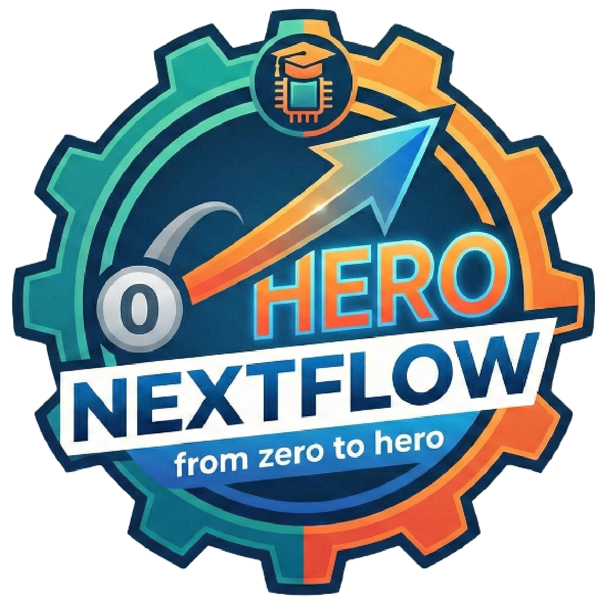

# NEXTLFOW - From zero to hero

Welcome to Nextflow - From zero to hero!



Please refer to the [github pages website](https://htgenomeanalysisunit.github.io/nextflow-zero2hero/) to navigate the training materials.

The data, slides and code examples used during the course are provided for you on out HPC in

```text
/project/nextflow_zero2hero
```

The main folder contains:

- slides: PDF version of presentations used during the course
- practicals: code examples used during practical sessions
- data: input data used to run the course example code
- containers: pre-built containers for the tool used during the practicals

## Instructors

- Youssef Abili
- Bruno Ariano
- Matteo Bonfanti
- Daniel Carrillo
- Edoardo Giacopuzzi
- Luigi Lamparelli
